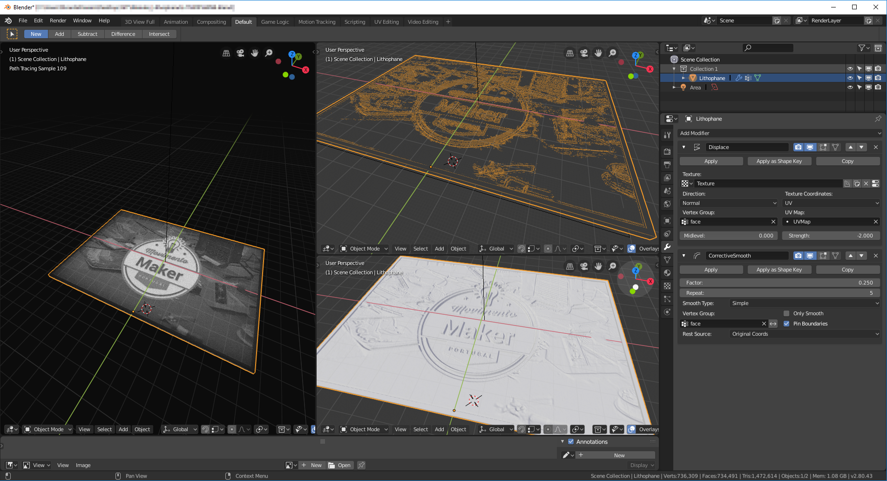

# Blender_Lithophane

## How to use

Like always i once more used blender in my projects, You have to download the last version of blender for these to work Blender 2.80.
After install you should open the folder Foto like image1

Then paste the photo you want replacing the existing one on the folder “FOTO.jpg”, the file should have a proportion of 10X15, if not it will be distorted!

Open the file “LITHOPHANE.blend” and your image should appear on the 3d model on Blender export it to STL and is done!

**I hope that you enjoyed the file, and printed craisy lithophanes!**